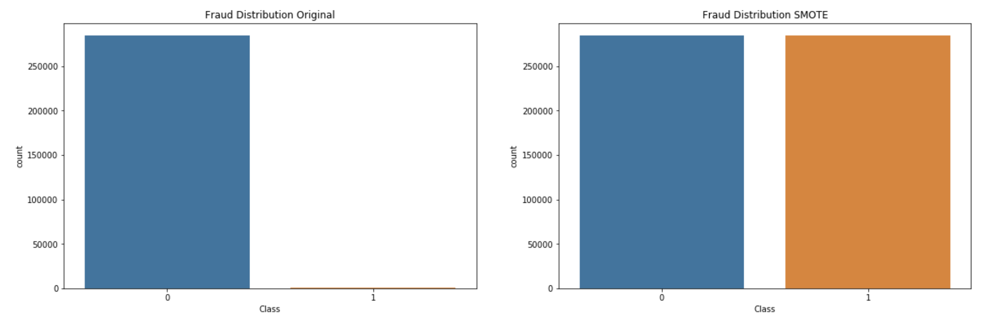
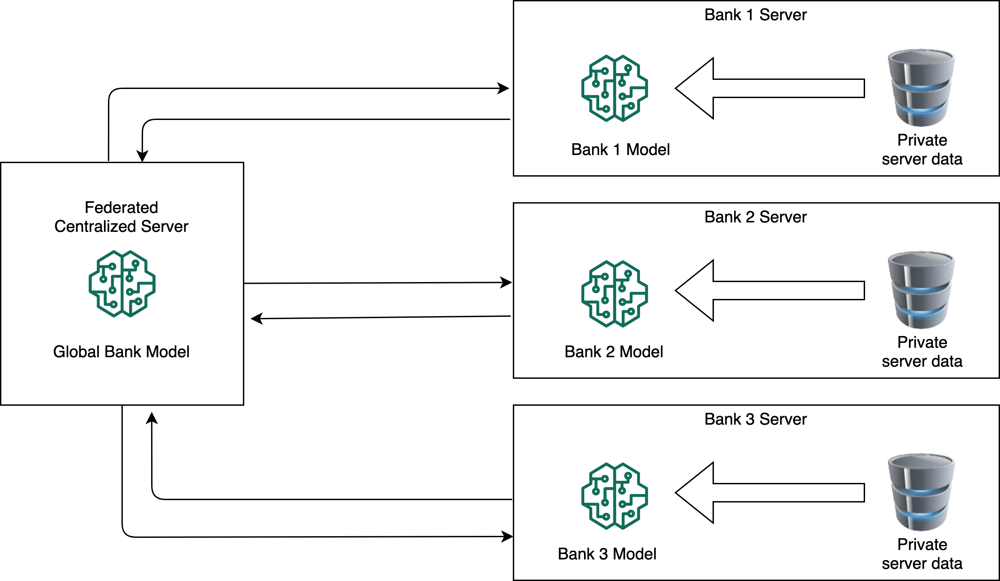
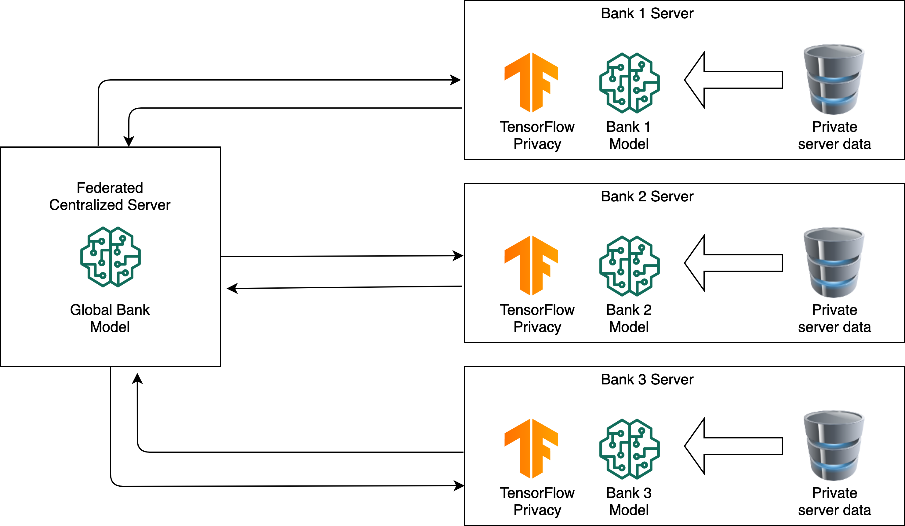

# URECA 

Undergraduate Student Research

## Dataset 

creditcard.csv

The dataset can be found at the following link: https://www.kaggle.com/mlg-ulb/creditcardfraud

### Pre-processing
1. Remove rows with NaN values

2. Balance the data set unsing SMOTE:

## Federated Learning Framework

### Before Adding Privacy:

### After Adding Tensorflow Privacy:

